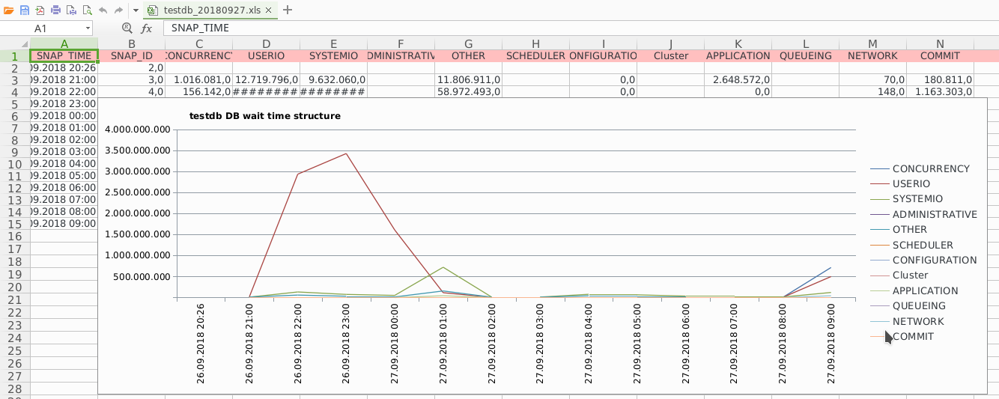

oracle-awr-report.py is easy-to-use data exporter from Oracle database to xls (Excel)

# Key features
* Export data from Oracle database to xls worksheet
* Charts drawing
* Customizing charts
* Adding computed columns

AWR SQL queries by [MaksimIvanovPerm](https://github.com/MaksimIvanovPerm). For Oracle Database AWR 12.1 or higher

# Prerequisite
* python 2.7 or higher
* cx_Oracle 5.3 or higher
* xlswriter 1.0.5 or higher

## Tested on
* python 2.7.12
  * cx_Oracle 6.4.1
  * xlsxwriter 1.0.9
* python 2.7.15
  * cx_Oracle 5.3
  * xlsxwriter 1.0.5
* python 3.6.5
  * cx_Oracle 6.3.1 
  * xlsxwriter 1.0.5

## Main configuration **conf.d/general.conf**
| Parameter name | Description                              		    | Mandatory | Not null
| -------------- | -------------------------------------------------------- | --------- | --------
| TNS_ALIAS      | alias from tnsnames.ora to db connection 		    | +-        | +
| HOST           | database server hostname/ipaddr			    | +-        | +
| PORT		 | database port (default: 1521)                            | -         | +
| SID            | database SID                                             | +-        | +
| SERVICE_NAME   | database SERVICE_NAME                                    | +-        | +
| USERNAME       | database login                            		    | +         | +
| PASSWORD       | database password                        		    | +         | +
| DBID		 | database id						    | -         | +
| BEGIN_SNAP     | awr begin snap_id  			                    | -         | +
| END_SNAP       | awr end snap_id                 		            | -         | +
| PREFIX         | path to report file                  		    | -         | -
| DB_NAME        | database title     			                    | +         | -
| AUTHOR         | report author                            		    | -         | -
| COMPANY        | report company            		                    | -         | -
| LOGGING        | log level, one of: DEBUG, INFO, WARNING, ERROR, CRITICAL | -         | +
| REPORT_CONF    | report configuration file 				    | +         | +

* When TNS_ALIAS exist, we using it. Otherwise we using HOST, PORT and SID/SERVICE_NAME
* When SID exist, we using it. Otherwise we using SERVICE_NAME

## Report configuration file
Format:
```
id:sql script:chart title:chart config file:columns config file
```
where chart config file is one of following:
1. **none** - not print chart
2. **default** - use all data to print one chart only
3. **custom charts configuration file name**

Example:
```
1:RDBMSServiceTime.sql:Стр-ра сервисного времени субд:default
2:WaitTimeStructure.sql:Стр-ра времени ожиданий субд:default
3:RedoStat.sql::conf.d/redostat.conf
```

## Custom charts configuration file
Format:
```
# id:column number in char:column title

```

Example:
```
1:25:Redo writes per hour
1:27:
2:34:Redo write latency, ms
3:27:Redo write structure
3:33:
```

## Custom columns configuration file
Format:
```
column number:column title:formula
```

**\_ROWID\_** - is service variable for rowid substitution

Example:
```
11:db_file_sequential_read:=UserIOWaitsTime!W_ROWID_/10000
12:userio:=WaitTimeStructure!D_ROWID_/10000
13:rr-latency:=C_ROWID_/E_ROWID_
```

## Report worksheet example

